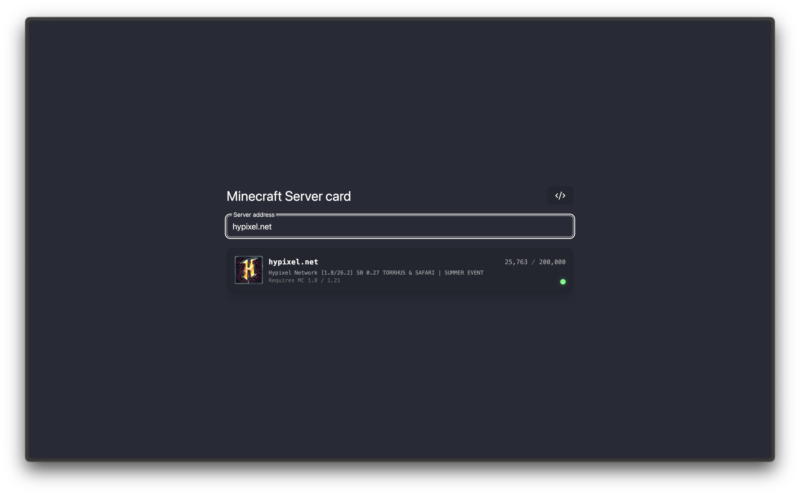

<div align="center">

# Minecraft Server Card

**A simple web app to check Minecraft Java server status and generate a server card by IP or domain.**

<br>


<br>



</div>

## Tech Stack

* [React](https://react.dev/) — UI framework
* [Vite](https://vite.dev/) — build tool and development server
* [TypeScript](https://www.typescriptlang.org/) — static typing
* [Tailwind CSS](https://tailwindcss.com/) & [daisyUI](https://daisyui.com/) — styling and UI components
* [Motion](https://motion.dev/) — smooth animations and layout transitions
* [mcstatus.io API](https://mcstatus.io/) — Minecraft server data fetching

## Getting Started

### Install dependencies

```bash
npm install
# or
bun install
# or
pnpm install

```

### Run development server

```bash
npm run dev
# or
bun dev
# or
pnpm dev

```

### Build for production

```bash
npm run build

```

### License 

All project code is available under the [MIT License](LICENSE).
